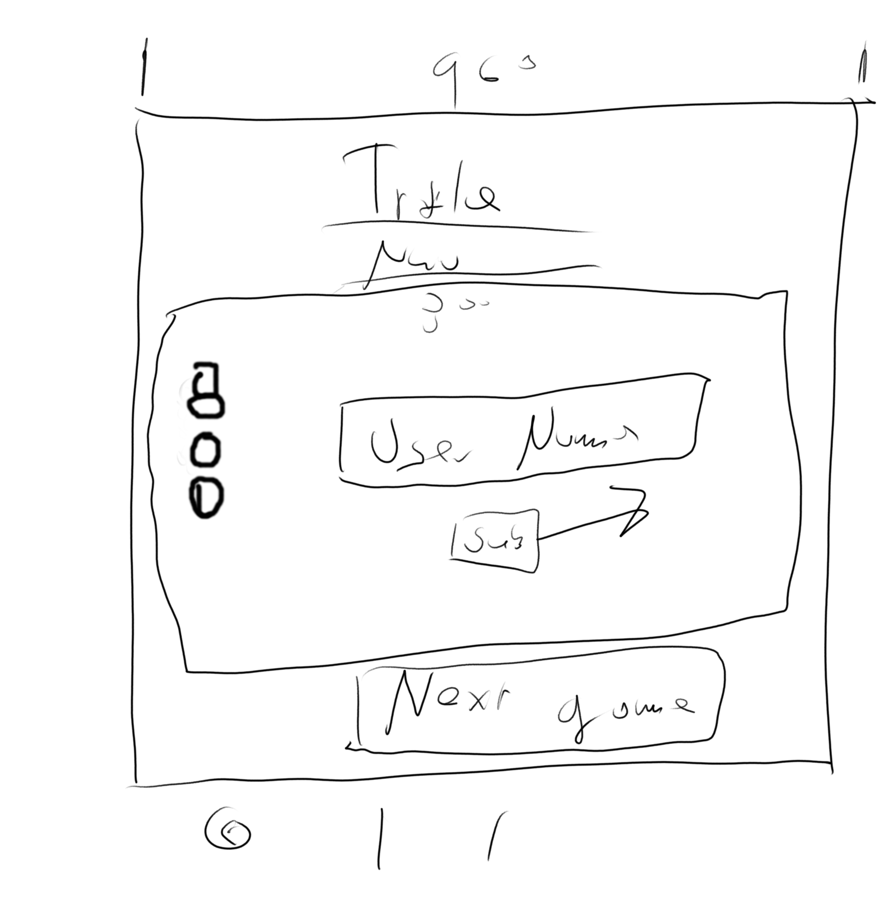

# User Stories

- 1st:
    - Title: Learning HTML/CSS/JavaScript
    - User Story Sentence: As a User, I want to have fun while learning, so I can exceed at Code 201. 
    - Feature Tasks:
        - Create 1 or 2 games
        - Invoke people’s competitive side to enhance learning.
        - Present concepts and words that were presented in Code 201 for the user to study
    - Acceptance Tests:
        - At least 1 fully working game
        - Take user’s name
    - Present the user’s score at the end

- 2nd:
    - Title: Memory Card Game
    - User Story Sentence: As a User, I want to fun to learn concepts, so I can pass Code 201
    - Feature Tasks:
        - Have cards that include words and other cards that include definitions.
        - Interaction between cards so the user knows when they get a correct answer
        - Have pleasing animation. 
    - Acceptance Tests:
        - Have card words and definitions match each other.
        - Have cards stay flipped over when they are clicked
        - Have a score stored into Local Storage associated with the user’s name

- 3rd:
    - Title: A keyword typing practice game
    - User Story Sentence: As a User, I want to get more familiar with JavaScript keywords, so I won’t have to look up the words when I am coding. 
    - Feature Tasks: 
        - Have keywords appear randomly
        - Have a way for the user to enter in a keyword
        - Have pleasing animation. 
    - Acceptance Tests:
        - Have a way to tell the user that the word was entered correctly
        - Have a high score stored in Local Storage associated with the User’s name

- 4th:
    - Title: Highscore page
    - User Story Sentence: As a user, I want to know my score, so that I can know how awesome I am at programming.
    - Feature Tasks: 
        - Have names presented with their high scores
        - Have scores ordered by high to low.
    - Acceptance Tests:
        - Connecting local storage to a table on the page
        - Sort the table in ascending order.

- 5th: 
    - Title: Title Page
    - User Story Sentence: As a User, I want to know how to navigate this site, so that I can have fun.
    - Feature Tasks:
        - Navigation bar
        - Instruction on how to use the site
        - What the user can expect
        - A place to accept the user name
    - Acceptance Tests:
        - Working buttons
        - A text box for the user to enter the name
        - The name getting entered into local storage.

- What is the vision of this product?
    - To have a website for people to learn more about programming. The website will have 1 or 2 games so that it will make learning more fun. We will include animations and a highscore to make the site more usable.
- What pain point does this project solve?
    - Learning how to program is hard. Using gamification will make help the learning process more faster. It takes 7 times to be exposed to something to learn it. If a user plays these games a few time it will help with their learning process.
- Why should we care about your product?
    - We need more programmers in the world. Having a site that will help people to learn how to program will help produce more programmers. These games are good for mental health. 

- Scope (In/Out)
    - IN - What will it do
        - Will have 1 or 2 games to help in the learning process.
        - Game 1 will be a memory style game
        - Game 2 will be a typing test/missile command style game.
        - There will be a entry for a User name
        - There will be a high score
    - OUT - What will you produce not do.
        - This site it won’t go into production
        - This will not be a dynamic website
        - There will not be any security measures with this site.

- MVP?
    - What will your MVP functionality be?
        - 1 to 2 functional games: games that work with at least barebones animation. 
        - User name and score stored into local storage
        - Scores displayed somewhere.
    - What are your stretch goals?
        - Better styling with a unified theme.
        - Complete animation for each game.
        - Highscore in ascending order.
        - Highscore room will have a dungeon room animation.

- Functional Requirements
    - List the functionality of your product. This will consist of tasks such as the following:
    - A game that has cards that have words and definitions that match
    - A game that presents keywords for the user to type
    - Scores stored that are associated with a user.
    - Scores that will be presented at the end of the site.
- Data Flow
    - Take in user name
    - Create a user object 
    - Store user object into storage

    - Start game 1
    - Generate scores for correct answers. 
    - Once the game ends store the score into the user’s local storage space.

